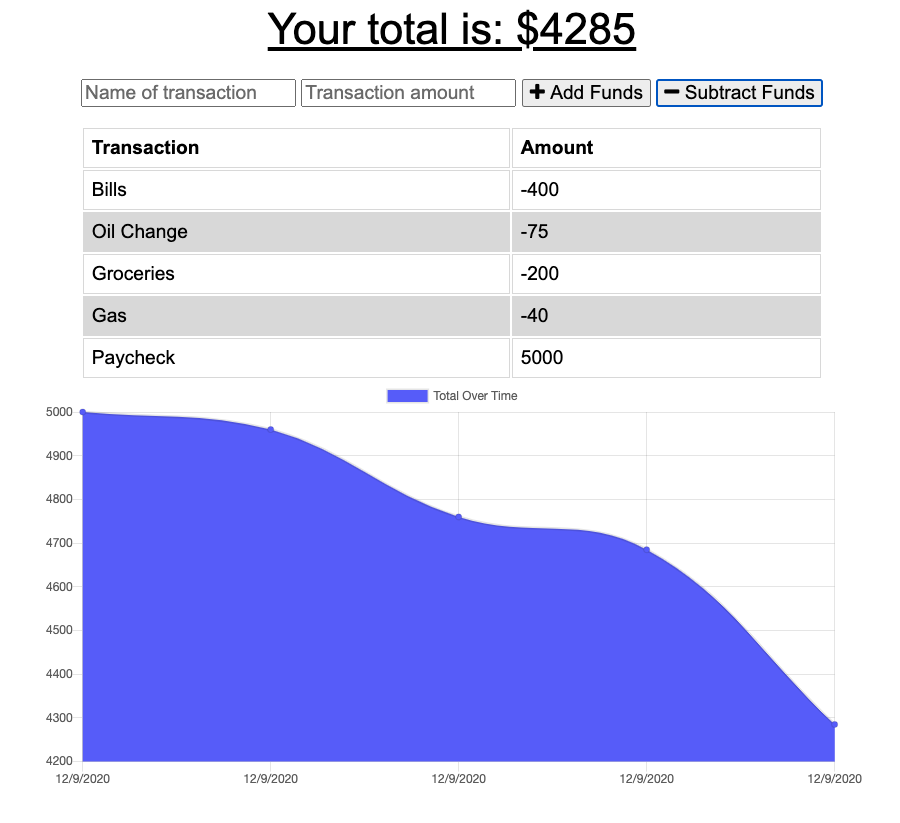

# Budget Tracker

## Description
This application allows the user to track their withdrawals and deposits on a computer or mobile device with or without an internet connection. If they add a transaction while offline, it automatically gets added once an internet connection is re-established and then the user is notified about the addition. The application can also be installed locally as a PWA (progressive web application).

## Screenshot

## Application Link
https://budget-tracker-owais.herokuapp.com/